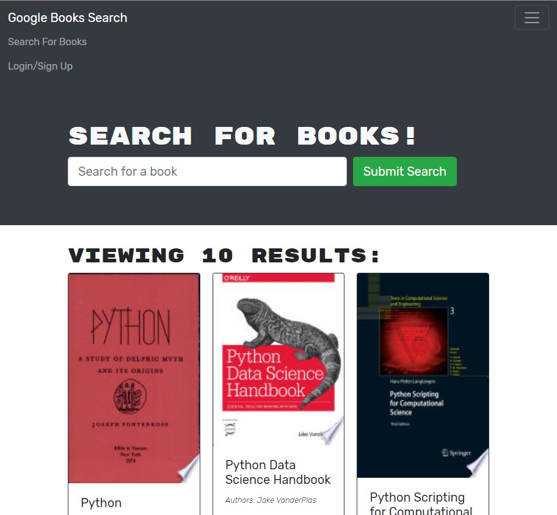

# Project Title
Challenge 21 

# Description
This project takes a fully functioning Google Books API search engine built with a RESTful API, and refactors it to be a GraphQL API built with Apollo Server. The app was built using the MERN stack, with a React front end, MongoDB database, and Node.js/Express.js server and API. It's already set up to allow users to save book searches to the back end.

Follow this [link](https://github.com/abergtra/challenge-21) for the GitHub repository.

# Table of Contents 
* [Installation](#-Installation)
* [Usage](#-Usage)
* [License](#-Installation)
* [Contributing](#-Contributing)
* [Tests](#-Tests)
* [Questions](#-Questions)
    
# Installation
No installation necessary! Just head to the live url in the "Usage" Section.

# Usage
Follow the [live url](https://agile-hollows-96656.herokuapp.com/) to search for books that you are interested in!

# License 
[License: MIT](https://opensource.org/licenses/MIT) 
* As this list provided is not comprehensive, if you need another license, contact the author for additional options. 

# Contributing 
Please contact the author about contributing.

# Tests
There are no tests available for this application.

# Questions
* GitHub Username: abergtra
* Contact Email: asher.bergtraun@gmail.com